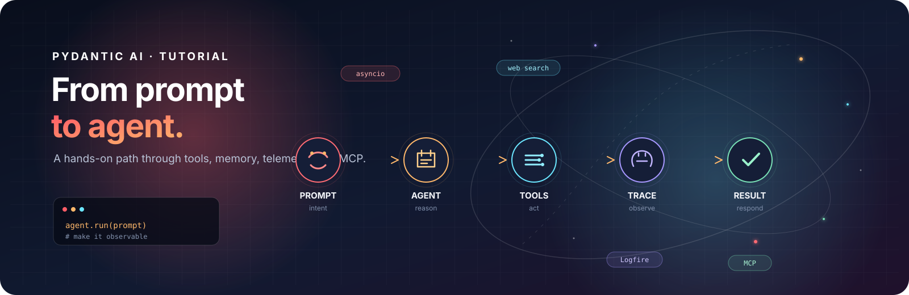

# pydantic-ai Tutorial



A small, hands-on path for learning **Pydantic AI** and agentic coding.

Each numbered script is a complete, runnable example. Read it, run it, then change something (instructions, tools, or the user prompt) so you can see how the agent behaves. You do not need a cloud API key for the default setup: the examples talk to a **local OpenAI-compatible server** (LM Studio) at `http://localhost:1234/v1`.

## What you will learn

1. Create an agent with a model and instructions
2. Chat in a loop and keep conversation history
3. Switch from sync (`run_sync`) to async (`agent.run`)
4. Give the agent **capabilities** (built-in web search)
5. Trace runs with **Logfire**
6. Add your own **tools** (`@agent.tool`)
7. Plug in **MCP** so the agent can drive a browser (Playwright)

## Prerequisites

- **Python 3.14+** (see `pyproject.toml`)
- **[uv](https://docs.astral.sh/uv/)** for the virtualenv and dependencies
- A local chat model served with an OpenAI-compatible API, for example [LM Studio](https://lmstudio.ai/)
- **Node.js / npx** only if you run lesson 007 (Playwright MCP)

Default model settings in the scripts:

| Setting | Value |
| --- | --- |
| Base URL | `http://localhost:1234/v1` |
| Model name | `nvidia/nemotron-3-nano-4b` |
| API key | `lm-studio` (placeholder; LM Studio accepts this) |

If your local model name or port is different, edit the `OpenAIChatModel` / `OpenAIProvider` block at the top of the script you are running.

## Setup

From this directory:

```bash
uv sync
```

Start LM Studio, load a model, and turn on the local server on port **1234**. Then run a lesson with:

```bash
uv run python 001_hello_world.py
```

Type `exit` (or Ctrl+C) to leave the interactive chat scripts.

## Suggested path

Work through the files in order. Later lessons reuse the same chat loop and add one new idea.

| Lesson | File | What to notice |
| --- | --- | --- |
| 1 | `001_hello_world.py` | Smallest possible agent: model + instructions + `run_sync`. One prompt, one reply. |
| 2 | `002_simple_agent_chat.py` | Interactive loop. `message_history` from `result.all_messages()` so the agent remembers the conversation. |
| 3 | `003_simple_agent_async_chat.py` | Same chat, but `asyncio` and `await agent.run(...)`. `asyncio.to_thread(input, ...)` keeps `input()` from blocking the event loop. |
| 4 | `004_simple_agent_async_with_tools copy.py` | **Web search** via `WebSearch(local="duckduckgo")`. After each turn, `result.new_messages()` is printed so you can see tool calls. |
| 5 | `005_simple_agent_async_with_tools_and_telemetry.py` | Same search agent, plus **Logfire** (`logfire.configure()` and `logfire.instrument_pydantic_ai()`). Instructions also limit how often the model may search. |
| 6 | `006_agent_async_with_multiple_tools_and_telemetry copy.py` | Search **plus a custom tool** (`get_temperature_in_celcius`). Tools are Python functions the model can call. |
| 7 | `007_agent_with_multiple_tools_and_telemetry_mcp.py` | Search, custom tool, **and Playwright MCP** (`MCPToolset` + `npx @playwright/mcp`). The agent can browse pages when you ask it to. |

There are extra `* copy.py` files next to some lessons. They are working copies of the same step; start from the numbered table above so you do not get lost.

`src/pydantic_ai_tutorial/` is the uv package stub (`uv run pydantic-ai-tutorial` only prints a hello message). The real learning material is the numbered scripts in the project root.

## Try this as you go

- **Lesson 1–3:** Change the `instructions` string. Ask a follow-up question in lesson 2 or 3 and confirm the agent uses earlier turns.
- **Lesson 4:** Ask something that needs live information (“search for …”). Compare the printed execution messages with the final answer.
- **Lesson 5:** Run a query, then open the Logfire UI and find the trace for that run.
- **Lesson 6:** Ask for a Fahrenheit-to-Celsius conversion and check that the custom tool is used.
- **Lesson 7:** Ask the agent to open a public page and summarize it. First run may take longer while `npx` downloads Playwright MCP.

## Telemetry (lessons 5–7)

Those scripts call `logfire.configure()`. On first run, Logfire may prompt you to authenticate. Credentials are stored locally under `.logfire/` (gitignored). You can still run the earlier lessons without Logfire.

## Extra notes for lesson 7

- Needs **npx** on your PATH.
- Playwright MCP is started with `--headless`.
- Browser session dumps may appear in `.playwright-mcp/` (gitignored).

## Project layout

```
.
├── 001_hello_world.py
├── 002_simple_agent_chat.py
├── 003_simple_agent_async_chat.py
├── 004_simple_agent_async_with_tools copy.py
├── 005_simple_agent_async_with_tools_and_telemetry.py
├── 006_agent_async_with_multiple_tools_and_telemetry copy.py
├── 007_agent_with_multiple_tools_and_telemetry_mcp.py
├── pyproject.toml
├── uv.lock
└── src/pydantic_ai_tutorial/
```

## Docs

- [Pydantic AI](https://ai.pydantic.dev/)
- [Logfire](https://logfire.pydantic.dev/)
- [Model Context Protocol](https://modelcontextprotocol.io/)
