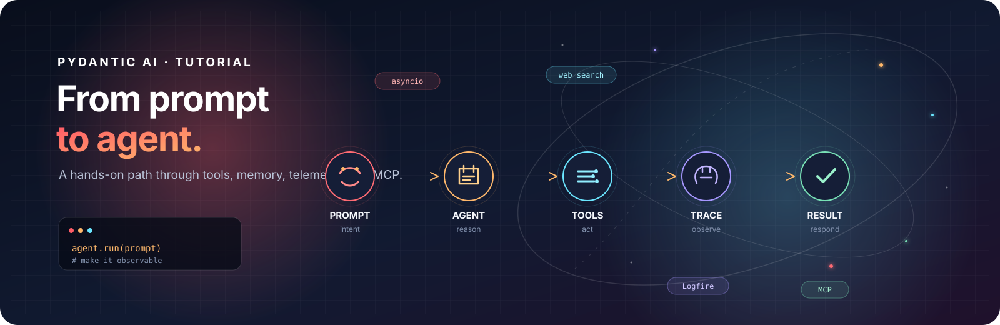

# pydantic-ai Tutorial



A small, hands-on path for learning **Pydantic AI** and agentic coding.

Each numbered script is a complete, runnable example. Read it, run it, then change something (instructions, tools, or the user prompt) so you can see how the agent behaves. You do not need a cloud API key for the chat model: lessons 1–7 and 11 talk to a **local OpenAI-compatible server** (LM Studio) at `http://localhost:1234/v1`. Lessons 8–10 read the same kind of settings from a `.env` file, so you can keep using a local model or point at another OpenAI-compatible endpoint. Lesson 11 also calls `load_dotenv()` so a Jev key (`TYPESAFE_API_KEY`) can live in that file; its chat model settings stay in the script.

## What you will learn

1. Create an agent with a model and instructions
2. Chat in a loop and keep conversation history
3. Switch from sync (`run_sync`) to async (`agent.run`)
4. Give the agent **capabilities** (built-in web search)
5. Trace runs with **Logfire**
6. Add your own **tools** (`@agent.tool`)
7. Plug in **MCP** so the agent can drive a browser (Playwright)
8. Give the agent **filesystem MCP** access inside a safe folder
9. Add a **restricted shell tool** for listing and searching files in that workspace
10. Serve the agent as a **FastAPI** endpoint (search + Playwright MCP + filesystem MCP)
11. Route each prompt to a specialised agent with **Jev** (`typesafe_sdk`)

## Prerequisites

- **Python 3.14+** (see `pyproject.toml`)
- **[uv](https://docs.astral.sh/uv/)** for the virtualenv and dependencies
- A local chat model served with an OpenAI-compatible API, for example [LM Studio](https://lmstudio.ai/)
- **Node.js / npx** if you run lesson 007 (Playwright MCP), 008 (filesystem MCP), or 010 (both)

Default model settings in lessons 1–7:

| Setting | Value |
| --- | --- |
| Base URL | `http://localhost:1234/v1` |
| Model name | `nvidia/nemotron-3-nano-4b` |
| API key | `lm-studio` (placeholder; LM Studio accepts this) |

If your local model name or port is different, edit the `OpenAIChatModel` / `OpenAIProvider` block at the top of the script you are running (lessons 1–7 and 11), or set the matching variables in `.env` (lessons 8–10).

## Setup

From this directory:

```bash
uv sync
```

Start LM Studio, load a model, and turn on the local server on port **1234**. Then run a lesson with:

```bash
uv run python 001_hello_world.py
```

Type `exit` (or Ctrl+C) to leave the interactive chat scripts. Lesson 10 is an HTTP server instead of a chat loop; see that row in the table below.

### Environment file (lessons 8–10)

Those scripts call `load_dotenv()` and expect a `.env` in this directory (gitignored). Create one with:

```bash
MODEL_NAME=nvidia/nemotron-3-nano-4b
BASE_URL=http://localhost:1234/v1
API_KEY=lm-studio
SAFE_FILE_SYSTEM_FOLDER=./tool_access
```

`SAFE_FILE_SYSTEM_FOLDER` is the only directory the agent should read or write. Create that folder before you run the lesson. The repo gitignores `tool_access/` and `workspace/` so generated files stay local.

Lesson 11 reads `TYPESAFE_API_KEY` from the same `.env` (see the notes for that lesson). It does not read `MODEL_NAME`, `BASE_URL`, or `API_KEY`.

## Suggested path

Work through the files in order. Later lessons reuse the same chat loop and add one new idea, until lesson 10 switches the loop for an HTTP API. Lesson 11 returns to the chat loop and routes each prompt.

| Lesson | File | What to notice |
| --- | --- | --- |
| 1 | `001_hello_world.py` | Smallest possible agent: model + instructions + `run_sync`. One prompt, one reply. |
| 2 | `002_simple_agent_chat.py` | Interactive loop. `message_history` from `result.all_messages()` so the agent remembers the conversation. |
| 3 | `003_simple_agent_async_chat.py` | Same chat, but `asyncio` and `await agent.run(...)`. `asyncio.to_thread(input, ...)` keeps `input()` from blocking the event loop. |
| 4 | `004_simple_agent_async_with_tools.py` | **Web search** via `WebSearch(local="duckduckgo")`. After each turn, `result.new_messages()` is printed so you can see tool calls. |
| 5 | `005_simple_agent_async_with_tools_and_telemetry.py` | Same search agent, plus **Logfire** (`logfire.configure()` and `logfire.instrument_pydantic_ai()`). Instructions also limit how often the model may search. |
| 6 | `006_agent_async_with_multiple_tools_and_telemetry.py` | Search **plus a custom tool** (`get_temperature_in_celcius`). Tools are Python functions the model can call. |
| 7 | `007_agent_with_multiple_tools_and_telemetry_mcp.py` | Search, custom tool, **and Playwright MCP** (`MCPToolset` + `npx @playwright/mcp`). The agent can browse pages when you ask it to. |
| 8 | `008_agent_with_file_edit_access.py` | Settings from `.env`. **Filesystem MCP** (`@modelcontextprotocol/server-filesystem`) scoped to `SAFE_FILE_SYSTEM_FOLDER`, prefixed as `fs`. |
| 9 | `009_agent_with_file_edit_bash_access.py` | Same `.env` workspace, plus a **custom shell tool** (`run_workspace_command`, `@agent.tool_plain`). Allowlist: `pwd`, `ls`, `cat`, `find`, `grep`, `head`, `tail`, `git`. |
| 10 | `010_agent_as_an_api.py` | Same search + Playwright + filesystem MCP stack, exposed as a **FastAPI** app. `POST /chat` with JSON; pass `session_id` to keep history. |
| 11 | `011_agent_with_jev.py` | Three agents (elementary, research, general) share one local model and web search. Jev classifies the prompt, then the matching agent answers. One `message_history` is shared. A failed classification falls back to the general agent. |

`src/pydantic_ai_tutorial/` is the uv package stub (`uv run pydantic-ai-tutorial` only prints a hello message). `src/pydantic_ai/` is a separate stub and is not the script entry point. The real learning material is the numbered scripts in the project root.

## Try this as you go

- **Lesson 1–3:** Change the `instructions` string. Ask a follow-up question in lesson 2 or 3 and confirm the agent uses earlier turns.
- **Lesson 4:** Ask something that needs live information (“search for …”). Compare the printed execution messages with the final answer.
- **Lesson 5:** Run a query, then open the Logfire UI and find the trace for that run.
- **Lesson 6:** Ask for a Fahrenheit-to-Celsius conversion and check that the custom tool is used.
- **Lesson 7:** Ask the agent to open a public page and summarize it. First run may take longer while `npx` downloads Playwright MCP.
- **Lesson 8:** Ask it to write a short `.md` file in the safe folder, then to read it back.
- **Lesson 9:** Ask it to list files in the workspace (`ls`) or search file contents (`grep`). Try a command that is not allowlisted and confirm it is rejected.
- **Lesson 10:** Start the API, then `POST` a prompt to `/chat`. Send a second request with the returned `session_id` and confirm it remembers the first turn. Open `/docs` for the interactive OpenAPI UI.
- **Lesson 11:** Ask a simple question, then a research-style question, and check the printed label (`Assisstant-elementary`, `Assisstant-research`, or `Assisstant-general`). Ask a follow-up and confirm the shared history still carries over.

## Telemetry (lessons 5–11)

Those scripts call `logfire.configure()`. On first run, Logfire may prompt you to authenticate. Credentials are stored locally under `.logfire/` (gitignored). You can still run the earlier lessons without Logfire.

## Extra notes for lesson 7

- Needs **npx** on your PATH.
- Playwright MCP is started with `--headless`.
- Browser session dumps may appear in `.playwright-mcp/` (gitignored).

## Extra notes for lessons 8–10

- Lesson 8 also needs **npx**; it starts `@modelcontextprotocol/server-filesystem` with the safe folder as the only allowed root.
- Lesson 9 does not attach filesystem MCP. It runs allowlisted commands (`pwd`, `ls`, `cat`, `find`, `grep`, `head`, `tail`, `git`) with `cwd` set to `SAFE_FILE_SYSTEM_FOLDER`, `PATH` set to `/usr/bin:/bin`, a 20 second timeout, and a ban on absolute paths and `..`.
- Do not point `SAFE_FILE_SYSTEM_FOLDER` at your home directory or this whole repo. Use a dedicated folder such as `./tool_access`.

## Extra notes for lesson 10

- Needs **npx** (Playwright MCP and filesystem MCP), the same `.env` as lessons 8–9, and **FastAPI**.
- The filename starts with a digit, so run the file directly rather than importing it as a module:

```bash
uv run python 010_agent_as_an_api.py
```

- The server listens on `http://127.0.0.1:8000`. FastAPI lifespan keeps the MCP subprocesses running for the life of the process instead of starting them on every request.
- `GET /health` is a liveness check. `POST /chat` accepts `{"prompt": "...", "session_id": "..."}`. Omit `session_id` on the first request; reuse the value from the response to continue the conversation.
- Chat history is **in memory**. Restarting the server clears sessions; files written via filesystem MCP stay in `SAFE_FILE_SYSTEM_FOLDER`.
- Example:

```bash
curl -X POST http://127.0.0.1:8000/chat \
  -H "Content-Type: application/json" \
  -d '{"prompt": "Search for Pydantic AI MCP and summarize the first result."}'
```

## Extra notes for lesson 11

- The chat model is hardcoded like lessons 1–7 (`nvidia/nemotron-3-nano-4b` at `http://localhost:1234/v1`).
- `TypeSafeClient()` needs `TYPESAFE_API_KEY` in `.env`. The client defaults to `https://api.typesafe.ai` and model `jev-latest` unless `TYPESAFE_BASE_URL` or `TYPESAFE_DEFAULT_MODEL` is set.
- Classification is one `Choice` question, `query_type`, with criteria `elementary`, `research`, and `general`. `identify_agent_type` calls `jev_client.system_one`.
- All three agents can search with `WebSearch(local="duckduckgo")`. The instructions differ by audience.
- Run it with `uv run python 011_agent_with_jev.py`.

## Project layout

```
.
├── 001_hello_world.py
├── 002_simple_agent_chat.py
├── 003_simple_agent_async_chat.py
├── 004_simple_agent_async_with_tools.py
├── 005_simple_agent_async_with_tools_and_telemetry.py
├── 006_agent_async_with_multiple_tools_and_telemetry.py
├── 007_agent_with_multiple_tools_and_telemetry_mcp.py
├── 008_agent_with_file_edit_access.py
├── 009_agent_with_file_edit_bash_access.py
├── 010_agent_as_an_api.py
├── 011_agent_with_jev.py
├── pyproject.toml
├── uv.lock
├── src/pydantic_ai_tutorial/
└── src/pydantic_ai/
```

## Docs

- [Pydantic AI](https://ai.pydantic.dev/)
- [Logfire](https://logfire.pydantic.dev/)
- [Model Context Protocol](https://modelcontextprotocol.io/)
- [Filesystem MCP server](https://github.com/modelcontextprotocol/servers/tree/main/src/filesystem)
- [FastAPI](https://fastapi.tiangolo.com/)
- [Playwright MCP](https://github.com/microsoft/playwright-mcp)
