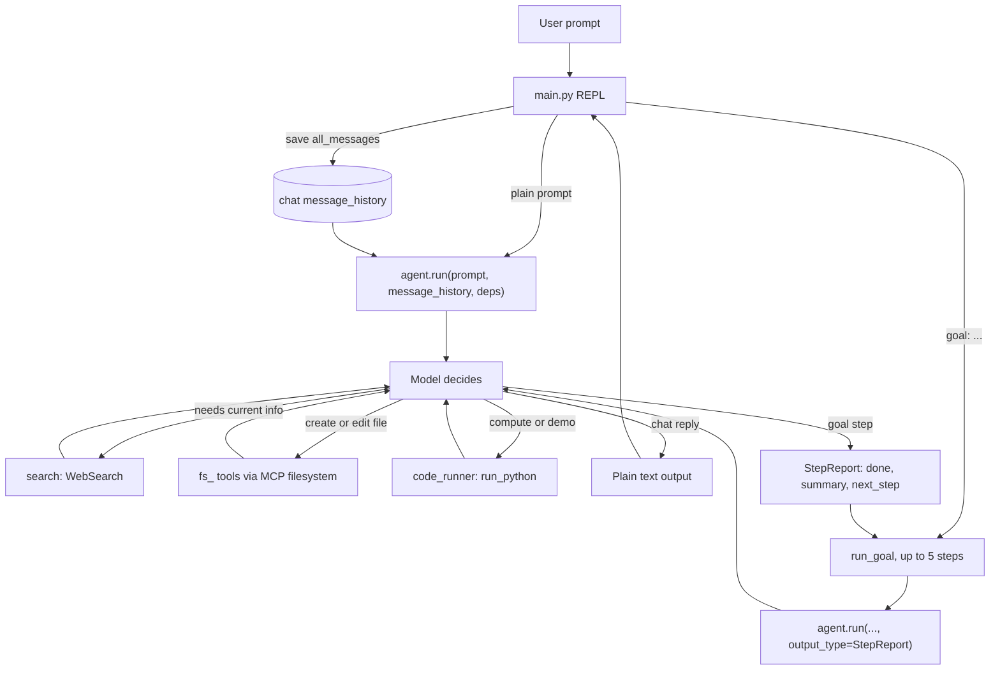

# Agent loop

A modular Pydantic AI agent that takes a user prompt and can:

- search the web for current information
- read, write, edit, and search files inside a workspace folder (via the MCP filesystem server)
- write a short Python script, run it, and use the output (or just show the code)

Normal chat returns plain text. A prompt that starts with `goal:` runs a short multi-step loop that stops when the model reports the goal is done.

## Module layout

| File | Responsibility |
| --- | --- |
| `config.py` | Load `.env`, build the model (`MODEL_NAME`, `BASE_URL`, `API_KEY`), resolve and create the workspace (`SAFE_FILE_SYSTEM_FOLDER`), start Logfire |
| `deps.py` | `AgentDeps`: a dataclass with `workspace: Path` |
| `search.py` | `WebSearch(local="duckduckgo")` capability, plus `SEARCH_INSTRUCTIONS` |
| `file_access.py` | MCP filesystem toolset (`npx @modelcontextprotocol/server-filesystem`), filtered and prefixed `fs` |
| `code_runner.py` | `FunctionToolset` with `run_python(code)`, plus `CODE_INSTRUCTIONS` |
| `agent.py` | The `Agent` (model, instructions, toolsets, capabilities) and `run_goal` |
| `main.py` | The REPL: read input, run one chat turn or a goal, print the reply, keep chat history |

`bash_access.py` is unused. Code execution lives in `code_runner.py`.

Tool modules depend on `AgentDeps` (through `RunContext`) or on `WORKSPACE` from `config`. They do not import each other. `agent.py` is the only place that wires them together.

## Flow



There are three loops:

- **Chat loop** (`main.py`): one iteration per user turn. It owns input, printing, exit handling, and the chat `message_history`.
- **Goal loop** (`run_goal` in `agent.py`): up to `MAX_STEPS` (5) model turns for a `goal:` prompt. It keeps its own history and does not write it back into the chat history.
- **Tool loop** (Pydantic AI, inside each `agent.run`): the model calls tools, sees their results, and repeats until it produces a final output.

The REPL enters the agent with `async with agent:` so the MCP filesystem process stays up for the session.

### One chat turn

1. `main.py` reads the prompt (`asyncio.to_thread(input, ...)`). `exit`, EOF, or Ctrl-C ends the session. A blank line is ignored.
2. A prompt that starts with `goal:` is handed to `run_goal` and does not update chat history.
3. Otherwise it calls `agent.run(prompt, message_history=..., deps=AgentDeps(workspace=...), usage_limits=UsageLimits(request_limit=15))`.
4. The model picks zero or more tools:
   - web search for current information, or when the user asks to search (at most twice; include source URLs).
   - `fs_read_text_file`, `fs_write_file`, `fs_edit_file`, `fs_list_directory`, `fs_search_files`, `fs_get_file_info` for file work. Paths must be absolute and inside the workspace. The MCP server is started with that folder as its only root.
   - `run_python` to execute or test code. The tool writes `workspace/scratch/snippet.py` and returns exit code, stdout, and stderr (or a timeout). If the user only wants to see the code, the model shows it and does not call the tool.
5. `main.py` prints `result.output` and saves `result.all_messages()` as the new chat history.

### One goal

`run_goal` repeats `agent.run` with `output_type=PromptedOutput(StepReport)`:

- `done`: true only when the whole goal is complete and verified
- `summary`: what this step did (printed as `[step N] ...`)
- `next_step`: what to do next when `done` is false

Each unfinished step is followed by `Continue toward the goal. Your planned next step: ...`. The loop prints `Goal complete.` or `Stopped after 5 steps without finishing.`

### PromptedOutput on this endpoint

`PromptedOutput` puts the `StepReport` JSON schema in the prompt. Pydantic AI then parses the model's text into `done`, `summary`, and `next_step`.

The model is built with `OpenAIChatModel` in `config.py`, so it starts from the OpenAI profile. That profile sets `supports_json_object_output=True`. With the flag on, `PromptedOutput` also sends `response_format: {"type": "json_object"}`.

`nvidia/nemotron-3-nano-4b` rejects that body:

```text
ModelHTTPError: status_code: 400, model_name: nvidia/nemotron-3-nano-4b,
body: 'response_format.type' must be 'json_schema' or 'text'
```

Leaving `output_type` unset drops `response_format`, so the call succeeds, but `result.output` is a string and `report.summary` / `report.done` fail.

`config.py` passes `profile=OpenAIModelProfile(supports_json_object_output=False)`. The flag merges over the OpenAI profile and turns off JSON-object mode. `PromptedOutput` then sends no `response_format` (plain text) and still validates the reply as `StepReport`. Chat turns in `main.py` do not set `output_type`, so they stay plain text.

`NativeOutput(StepReport)` would send `response_format.type = json_schema`, which this server also accepts. The goal loop stays on `PromptedOutput` so the small local model can call tools and return JSON in the message text.

## Instructions and limits

Static instructions in `agent.py` combine a short system line with `SEARCH_INSTRUCTIONS` and `CODE_INSTRUCTIONS`. A dynamic `@agent.instructions` hook adds the workspace path, tells the model to pass absolute paths to the `fs_` tools, and notes that `run_python` runs in `workspace/scratch`.

- Agent `retries=3`.
- Each `agent.run` uses `UsageLimits(request_limit=15)`.
- `run_python` does not raise `ModelRetry`. The instructions tell the model to read the error, fix the code, and run again at most 3 times.
- Logfire is configured in `config.py` (`logfire.configure()` and `logfire.instrument_pydantic_ai()`).

## Code execution

`run_python` strips a leading ` ```python ` fence, writes `scratch/snippet.py` (overwriting the previous snippet), and runs it with `sys.executable`. The process `cwd` is `scratch`, the timeout is 15 seconds, and output is truncated to the last 2000 characters.

## Pointers and gotchas

- Tool docstrings and type hints are the tool schema the model sees. Write them for the model.
- `@toolset.tool` receives `ctx: RunContext[...]`; `@toolset.tool_plain` does not. `run_python` needs `ctx` for the workspace. The filesystem tools get their root from the MCP server args, not from `ctx.deps`.
- File tools require Node/`npx` so `@modelcontextprotocol/server-filesystem` can start.
- Small local models struggle with many tools at once. If calls go wrong, test each toolset alone, then combine.
- Running model-written Python is the risky part. Current limits: scratch `cwd`, a timeout, and truncated output. The process inherits the parent environment.

## Manual test prompts

- "search for the latest Pydantic AI release"
- "create notes.md with a short summary of agent loops"
- "in notes.md, change 'agent loops' to 'tool loops'"
- "write and run code that prints primes under 50"
- "just show me code for fizzbuzz, don't run it"
- "goal: write scratch/answers.md with the current Python version, verified by running code"

## Docs to read

Pydantic AI docs: Capabilities (`WebSearch`), MCP toolsets (`MCPToolset`, `filtered`, `prefixed`), Dependencies (`deps_type`, `RunContext`), Output (`PromptedOutput`), Usage limits, Message history.
